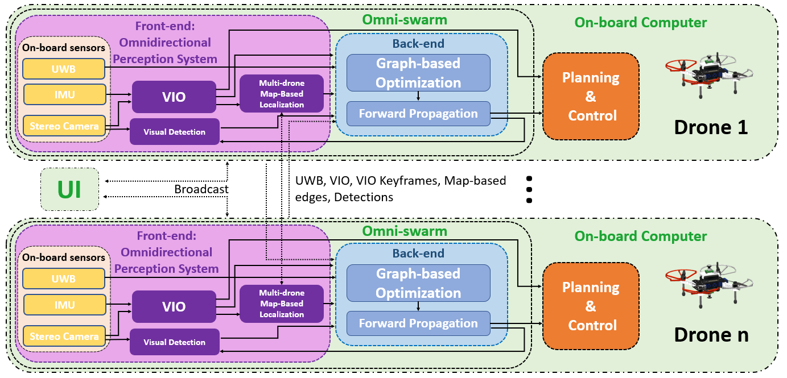
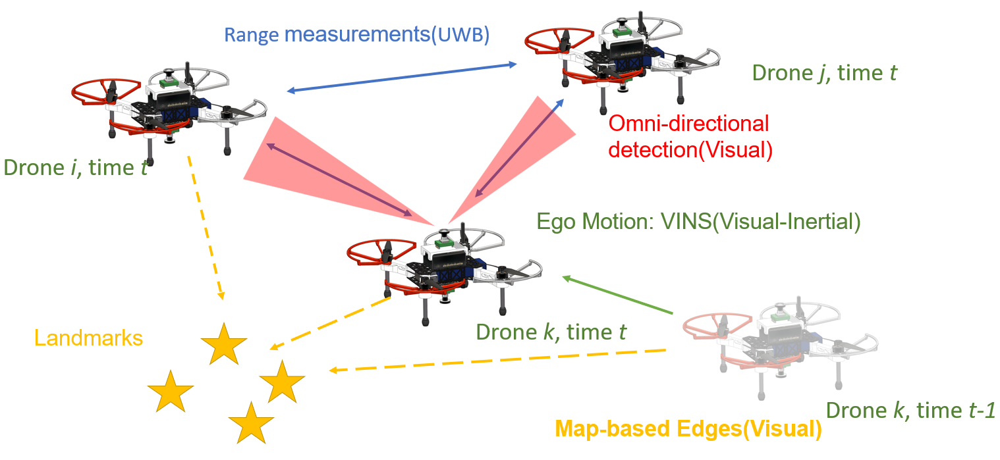
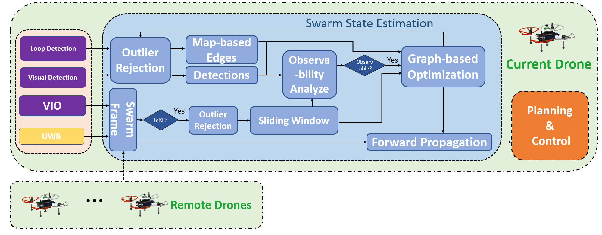

# Omni-swarm
A Decentralized Omnidirectional Visual-Inertial-UWB State Estimation System for Aerial Swarm

## Introduction

**Omni-swarm** is a decentralized omnidirectional visual-inertial-UWB state estimation system for the aerial swarm.
In order to solve the issues of observability, complicated initialization, insufficient accuracy and lack of global consistency, we introduce an omnidirectional perception system as the front-end of the **Omni-swarm**, consisting of omnidirectional sensors, which includes stereo fisheye cameras and ultra-wideband (UWB) sensors, and algorithms, which includes fisheye visual inertial odometry (VIO), multi-drone map-based localization and visual object detection.
A graph-based optimization and forward propagation working as the back-end of the **Omni-swarm** to fuse the measurements from the front-end.
According to the experiment result, the proposed decentralized state estimation method on the swarm system achieves centimeter-level relative state estimation accuracy while ensuring global consistency. Moreover, supported by the **Omni-swarm**, inter-drone collision avoidance can be accomplished in a whole decentralized scheme without any external device, demonstrating the potential of **Omni-swarm** to be the foundation of autonomous aerial swarm flights in different scenarios.
       

The structure of Omni-swarm is

The fused measurements of Omni-swarm:

The detailed backend structure of state estimation of Omni-swarm:

## Usage
The Omni-swarm offical support TX2 with Ubuntu 18.04. For those running on other hardware and system setup, converting the models to trt by your own is essential.

[Here](https://www.dropbox.com/s/skq1vgfeawiw151/models.zip?dl=0) to download the CNN models for Omni-swarm and extract it to swarm_loop folder.

[Here](https://www.dropbox.com/sh/yrm3ga7swrbx96i/AACqIMY55H2B5C_HKEwsMJYVa?dl=0) to get the raw and preprocessed offical omni-directional and pinole dataset.

[swarm_msgs](https://github.com/HKUST-Swarm/swarm_msgs) [inf_uwb_ros](https://github.com/HKUST-Swarm/inf_uwb_ros) are compulsory.
And [swarm_detector](https://github.com/HKUST-Swarm/swarm_detector) if you want to use detector, 

First, running the pinhole or fisheye version of [VINS-Fisheye](https://github.com/HKUST-Aerial-Robotics/VINS-Fisheye) (Yes, VINS-Fisheye is pinhole compatiable and is essential for Omni-swarm).

Start map-based localization with
>roslaunch swarm_loop nodelet-sfisheye.launch

or pinhole version

>roslaunch swarm_loop realsense.launch

Start visual object detector by (not compulsory)
> roslaunch  swarm_detector detector.launch

Start UWB communication module with (Support NoopLoop UWB module only)

>roslaunch localization_proxy uwb_comm.launch start_uwb_node:=true

If you don't have a UWB module, you may start the communication with a self id(start from 1, different on each drone)
>roslaunch localization_proxy uwb_comm.launch start_uwb_node:=true enable_uwb:=false self_id:=1

Start state estimation with visualizer by

>roslaunch swarm_localization loop-5-drone.launch bag_replay:=true viz:=true enable_distance:=false cgraph_path:=/home/your-name/output/graph.dot

You may enable/disable specific measurement by adding
>enable_distance:=false or enable_detection:=false enable_loop:=true

To visualize the real-time estimation result, use __viz:=true__. 
Add __bag_replay:=true__ only when evaluation dataset, when evaluate pre-processed dataset, you may only launch __loop-5-drone.launch__
Some analysis tools is located in [DataAnalysis](swarm_localization/DataAnalysis)

## LICENSE
GPLV3
